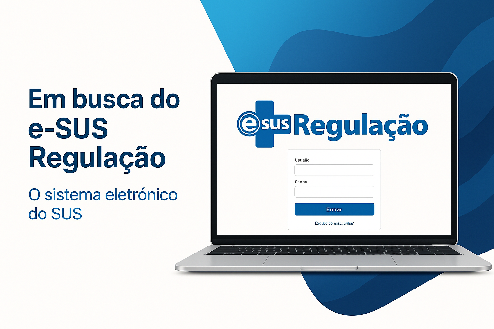
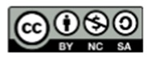

<!-- 
Acesso          - nav_order: 1
Adminitrador    - nav_order: 2
Solicitante     - nav_order: 3
Regulador       - nav_order: 4
Executante      - nav_order: 5
Coordenador     - nav_order: 6
LGPD            - nav_order: 9
/imagem 
-->

# Manual e-SUS Regulação

Bem-vindo ao manual online do sistema e-SUS Regulação.

 
 

*Elaboração, distribuição e informações* 

**MINISTÉRIO DA SAÚDE** 
Secretaria de Atenção Especializada à Saúde - SAES 
Departamento de Regulação Assistencial e Controle - DRAC  
Coordenação-Geral de Regulação Assistencial - CGRA 
Esplanada dos Ministérios - Anexo B- 1º andar 
CEP: 70.058-900 – Brasília/DF 

**Ficha Catalográfica** 

2025 Ministério da Saúde 
Esta obra é disponibilizada nos termos da Licença Creative Commons – Atribuição – Não Comercial – Compartilhamento pela mesma licença 4.0 Internacional. É permitida a reprodução parcial ou total desta obra, desde que citada a fonte. 
Tiragem: Edição revista e ampliada – 2025 – Versão eletrônica 

 Elaboração, distribuição e informações: 

**Ministro de Estado de Saúde** 
Alexandre Rocha Santos Padilha

**Coordenadora-Geral de Regulação Assistencial** 
Debora Spalding Verdi

**Diretor do Departamento de Regulação Assistencial e Controle** 
Carlos Amilcar Salgado

**Organização** 
Otavio Augusto dos Santos

**Elaboração de texto** 
Otavio Augusto dos Santos, Alyne Azevedo Lemos, Lorenna Almeida Ramalho

**Revisão Técnica**  
Ana Angelica Caires Ribeiro, Debora Spalding Verdi
